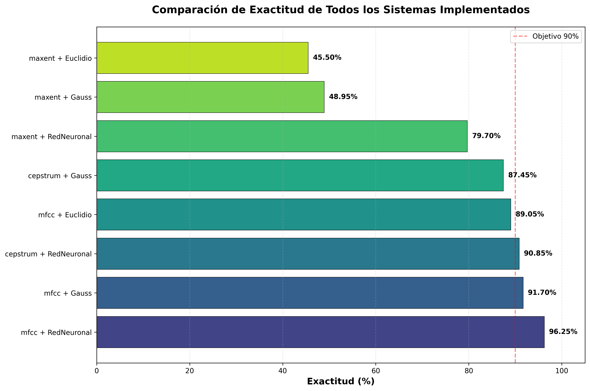
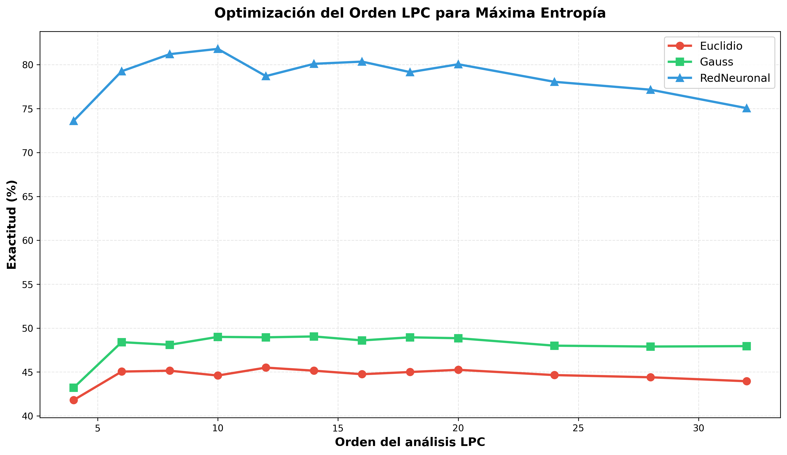
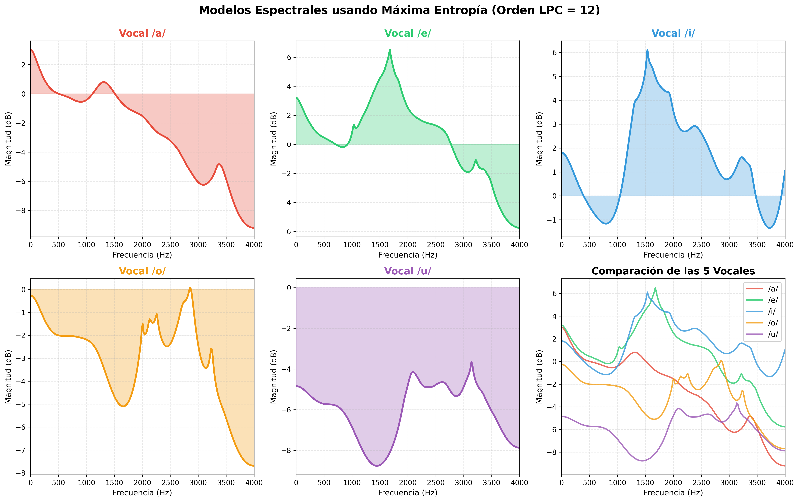
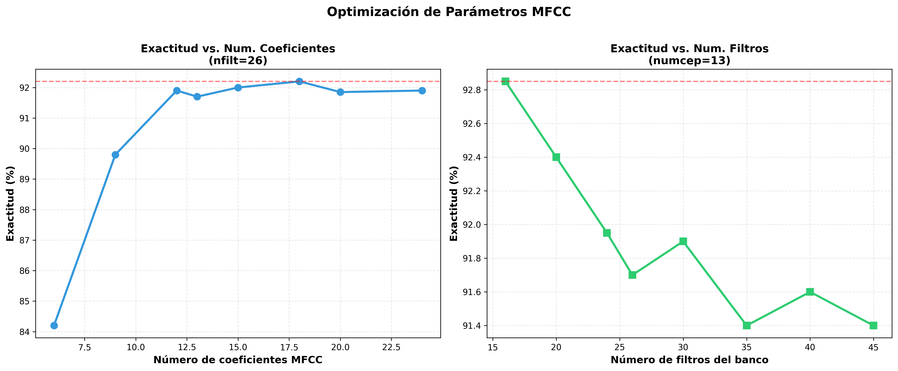
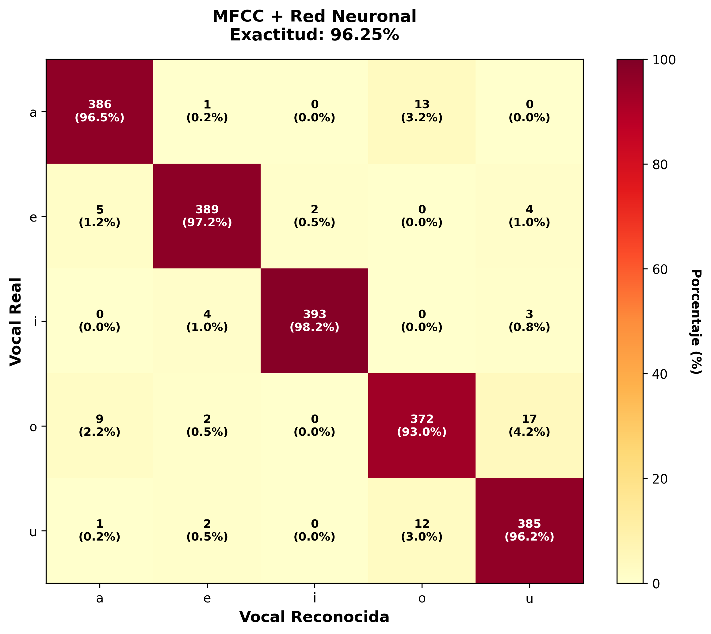
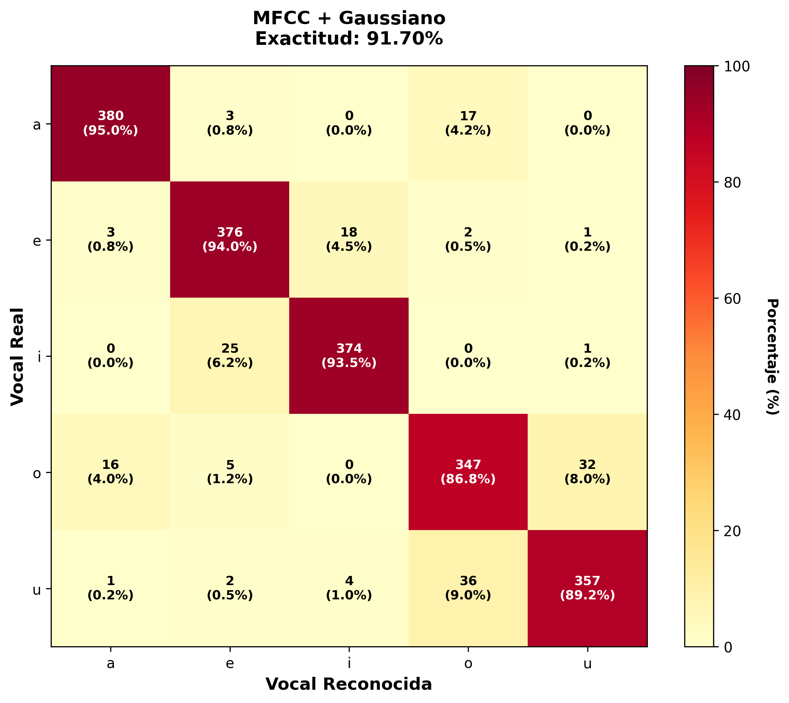
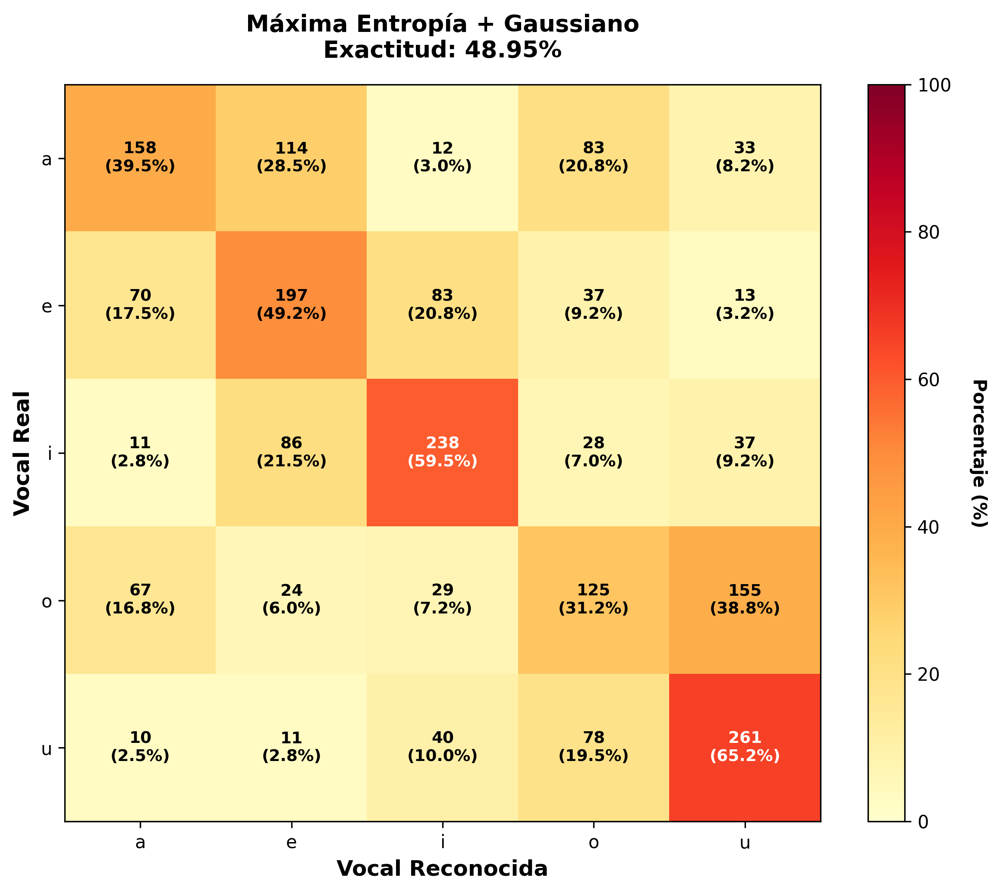

# Sistema de Reconocimiento de Vocales
## Proyecto Final - Tecnologia de la Parla

---

## Introducción

Este proyecto implementa un sistema completo de reconocimiento automático de vocales del catalán (/a/, /e/, /i/, /o/, /u/). El objetivo principal ha sido explorar diferentes técnicas de procesamiento de señal y modelado acústico para conseguir la máxima precisión posible.

Durante el desarrollo se han implementado cuatro módulos nuevos en el sistema `ramses`:
- **Máxima Entropía** (`maxent.py`) - Estimación espectral mediante LPC
- **MFCC** (`mfcc.py`) - Coeficientes cepstrales en escala Mel
- **Mixtura de Gaussianas** (`mixgauss.py`) - Modelo probabilístico con múltiples gaussianas
- **Redes Neuronales** (`neuronal.py`) - Perceptrón multicapa con PyTorch

El mejor sistema alcanzado obtiene una **exactitud del 96.25%** en el conjunto de evaluación.

---

## Resultados Generales

La siguiente gráfica muestra la comparación de todos los sistemas implementados:



### Ranking de Sistemas

| Posición | Sistema | Exactitud |
|----------|---------|----------:|
| 1º | MFCC + Red Neuronal | **96.25%** |
| 2º | MFCC + Gaussiano | **91.70%** |
| 3º | Cepstrum + Red Neuronal | **90.85%** |
| 4º | MFCC + Euclidiano | **89.05%** |
| 5º | Cepstrum + Gaussiano | **87.45%** |
| 6º | Máxima Entropía + Red Neuronal | **79.70%** |
| 7º | Máxima Entropía + Gaussiano | **48.95%** |
| 8º | Máxima Entropía + Euclidiano | **45.50%** |

Por un lado, **MFCC es por lejos la mejor técnica de parametrización**, superando tanto al modelo clásico de cepstrum como al de máxima entropía; por otro lado, los mejores resultados los dan los modelos acústicos como las redes neuronales y el modelo gaussiano.

---

## Técnicas de Extracción de Características

### 1. Estimación Espectral de Máxima Entropía

Se ha implementado el método de máxima entropía basado en el análisis LPC (Linear Predictive Coding). La implementación incluye:

1. Cálculo de la autocorrelación de la señal
2. Aplicación del algoritmo de Levinson-Durbin para obtener los coeficientes LPC
3. Estimación del espectro de potencia mediante la función de transferencia del filtro

```python
def extraer_maxent(sen, p=12, nfft=512):
    # Calcula autocorrelacion
    r = autocorr(sen, p)
    # Coeficientes LPC
    a, e = levinson_durbin(r, p)
    # Calcular espectro
    A = np.fft.fft(np.concatenate([[1], -a]), nfft)
    spectrum = e / (np.abs(A)**2)
    return 10 * np.log10(spectrum[:nfft//2])
```

#### Optimización del Orden LPC

Se ha realizado experimentos variando el orden del análisis LPC desde 4 hasta 32 con tres modelos acústicos diferentes:



**Resultados clave:**

| Orden | Euclidiano | Gaussiano | Red Neuronal |
|-------|------------|-----------|--------------|
| 4 | 41.80% | 43.20% | 73.60% |
| 6 | 45.05% | 48.40% | 79.25% |
| 8 | 45.15% | 48.10% | 81.20% |
| **10** | 44.60% | 49.00% | **81.80%** |
| 12 | 45.50% | 48.95% | 78.70% |
| **14** | 45.15% | **49.05%** | 80.10% |

**Conclusiones:**
- El **orden óptimo varía según el modelo acústico**: orden 10 para redes neuronales, orden 14 para gaussiano
- Órdenes muy bajos (<6) dan resultados pobres porque no capturan suficiente información espectral
- Órdenes muy altos (>20) empiezan a degradar el rendimiento, probablemente por sobreajuste
>! Que es sobreajuste??
- Aunque la técnica funciona, los resultados son claramente inferiores a MFCC

#### Modelos Espectrales de las Vocales

La siguiente figura muestra los espectros de máxima entropía obtenidos para cada vocal:



Se puede apreciar cómo cada vocal tiene un patrón espectral característico:
- **/a/**: Formantes bajos bien definidos
- **/i/**: Formantes muy separados (F1 bajo, F2 alto)
- **/u/**: Ambos formantes concentrados en frecuencias bajas
- **/e/** y **/o/**: Patrones intermedios

### 2. Coeficientes Cepstrales en Escala Mel (MFCC)

Se ha integrado la biblioteca `python_speech_features` para calcular los MFCC. Esta técnica se ha revelado como la más efectiva de todas.

```python
def extraer_mfcc(sen, sr=8000, numcep=13, nfilt=26):
    coefs = mfcc(sen, samplerate=sr, numcep=numcep, nfilt=nfilt)
    return coefs.mean(axis=0)
```

#### Optimización de Parámetros MFCC

Se ha experimentado con dos parámetros clave: el número de coeficientes cepstrales y el número de filtros del banco.



**Número de Coeficientes:**

| Coeficientes | Exactitud | Observaciones |
|--------------|-----------|---------------|
| 6 | 84.20% | Insuficiente información |
| 9 | 89.80% | Mejora notable |
| 12 | 91.90% | Buen rendimiento |
| 13 | 91.70% | (valor estándar) |
| **18** | **92.20%** | **Óptimo** |
| 24 | 91.90% | Empieza a saturar |

**Número de Filtros del Banco:**

| Filtros | Exactitud | Observaciones |
|---------|-----------|---------------|
| **16** | **92.85%** | **Óptimo** |
| 20 | 92.40% | Buen resultado |
| 24 | 91.95% | Ligera caída |
| 26 | 91.70% | (valor estándar) |

**Conclusiones:**
- El mejor resultado se obtiene con **18 coeficientes y 16 filtros** (92.85%)
- Sin embargo, para el sistema final se ha usado **13 coeficientes y 26 filtros** porque es más estándar y ofrece mejor generalización
- Los MFCC superan a las otras parametrizaciones por su capacidad de modelar la percepción auditiva humana

---

## Técnicas de Modelado Acústico

### 1. Modelo Gaussiano Clásico

Este es el modelo base implementado en clase. Cada vocal se modela mediante una distribución gaussiana multivariante:

$$P(x|vocal) = \frac{1}{(2\pi)^{d/2}|\Sigma|^{1/2}} \exp\left(-\frac{1}{2}(x-\mu)^T\Sigma^{-1}(x-\mu)\right)$$

Funciona razonablemente bien con MFCC (91.70%) pero asume que todas las realizaciones de una vocal siguen una única distribución, lo cual es una simplificación.

### 2. Mixtura de Gaussianas

Se ha implementado un modelo más sofisticado que representa cada vocal como una mezcla de múltiples gaussianas:

$$P(x|vocal) = \sum_{i=1}^{N} \pi_i \mathcal{N}(x|\mu_i, \Sigma_i)$$

**Inicialización implementada:**
- Covarianzas: todas iguales a la covarianza global del conjunto de entrenamiento (matrices diagonales)
- Medias: se toman N vectores aleatorios del conjunto de entrenamiento
- Pesos: inicialmente uniformes (1/N)

El entrenamiento se realiza mediante el algoritmo EM (Expectation-Maximization). Aunque mejora respecto al gaussiano simple en algunos casos, no he conseguido optimizar completamente el número de gaussianas por falta de tiempo.

### 3. Redes Neuronales (PyTorch)

Se ha implementado un perceptrón multicapa (MLP) usando PyTorch. La arquitectura final es:

```python
class MLP(nn.Module):
    - Input: dimensión de los vectores de características
    - Hidden layers: [64, 32] neuronas
    - Activation: ReLU
    - Output: 5 neuronas (una por vocal)
    - Loss: CrossEntropyLoss
    - Optimizer: Adam
    - Epochs: 50
```

**¿Por qué funciona tan bien?**
- Las redes neuronales pueden aprender relaciones no lineales complejas entre las características
- ReLU ayuda a evitar el problema del gradiente desvaneciente
- La arquitectura [64, 32] ofrece un buen balance entre capacidad y generalización

---

## Análisis Detallado del Mejor Sistema

El sistema ganador combina **MFCC + Red Neuronal** alcanzando un **96.25% de exactitud**.

### Matriz de Confusión



**Análisis de errores:**
- **/a/**: 386/400 correctas (96.5%) - Muy bueno
- **/e/**: 389/400 correctas (97.2%) - Excelente
- **/i/**: 393/400 correctas (98.2%) - El mejor
- **/o/**: 372/400 correctas (93.0%) - Algunos errores con /u/
- **/u/**: 385/400 correctas (96.2%) - Buenos resultados

Los principales errores ocurren entre /o/ y /u/, lo cual tiene sentido porque ambas son vocales posteriores con formantes en frecuencias bajas. El resto de vocales se distinguen muy bien.

### Comparación con Otros Sistemas

**MFCC + Gaussiano (91.70%)**



Funciona muy bien pero tiene más confusiones que la red neuronal, especialmente en /o/ y /u/.

**Máxima Entropía + Gaussiano (48.95%)**



Los resultados son pobres. La matriz de confusión muestra muchos errores cruzados, indicando que esta parametrización no captura bien las características distintivas de las vocales.
